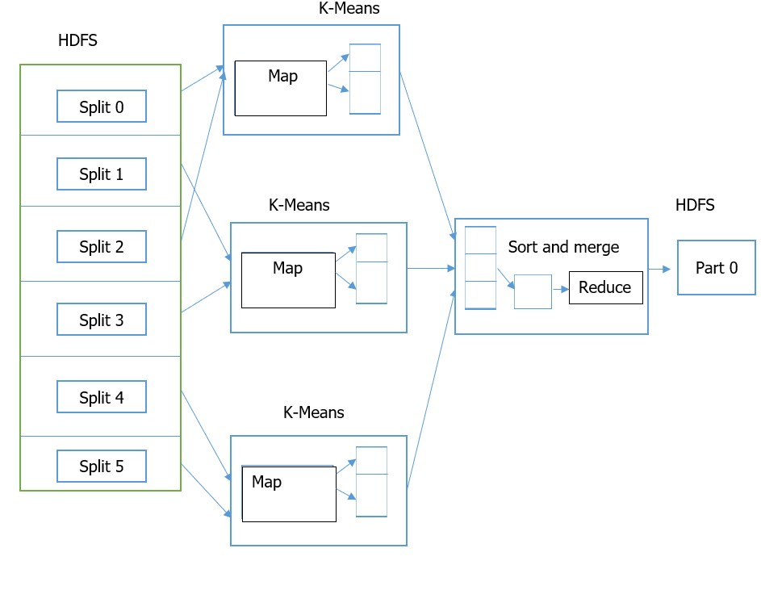
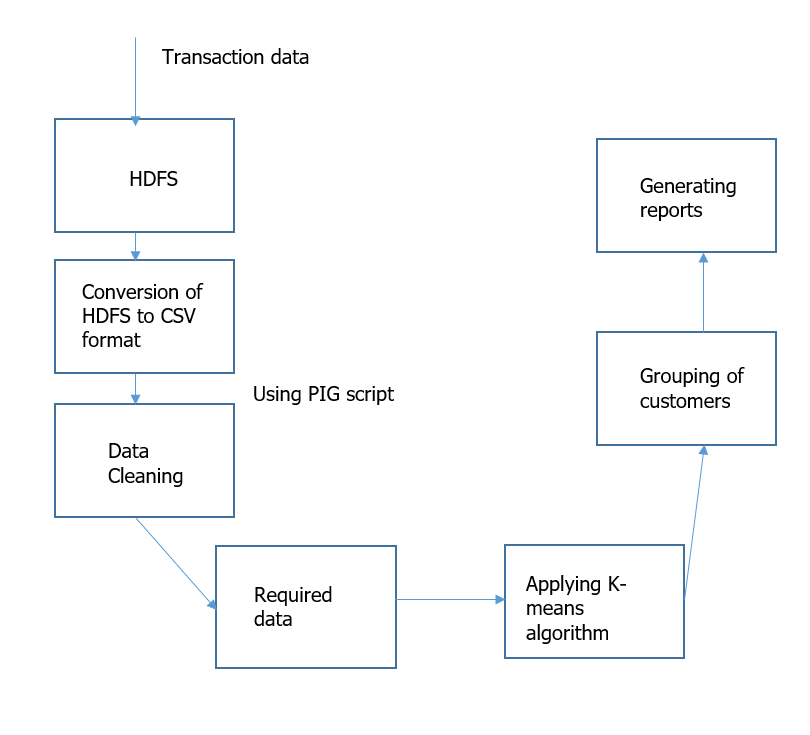
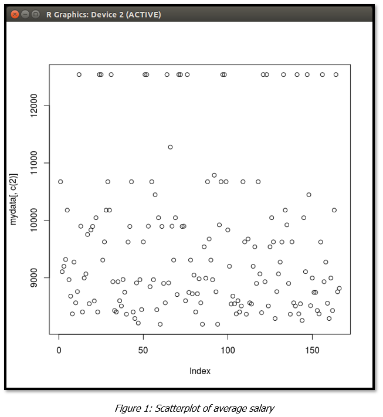
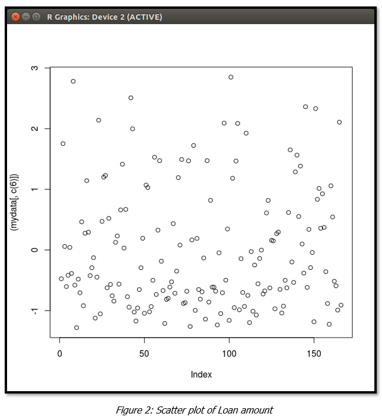
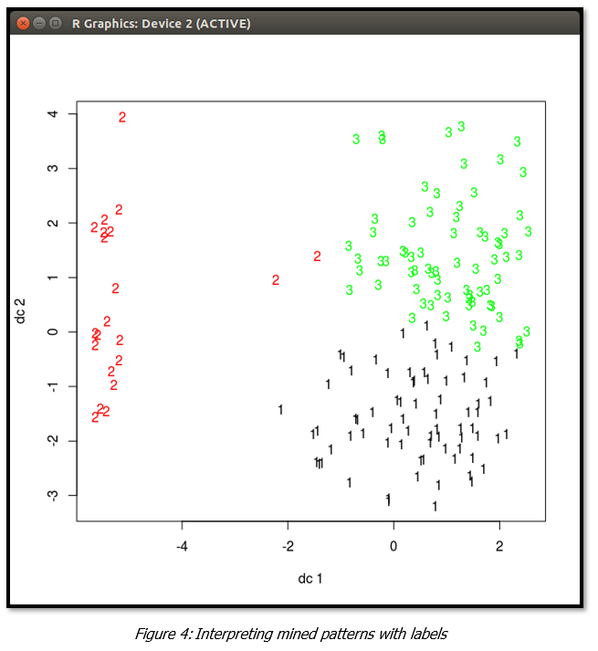
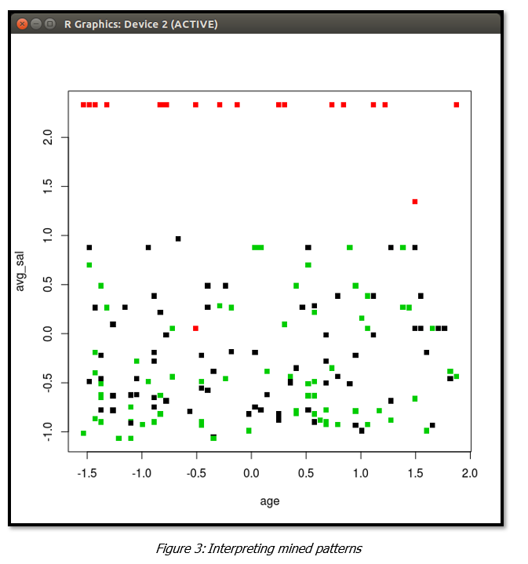
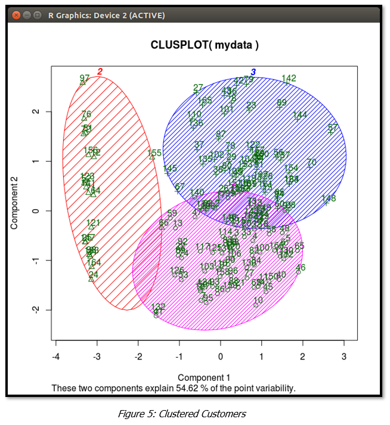

# BigDataAnalyticsUsingHadoop

## Goal:
The aim of the project is to classify bank customers into three categories like "gold", "silver" and "lead" by analysing their various financial related aspects. We analysed data using machine learning algorithm in Hadoop eco-system and various technologies like R, PIG, HIVE are utilised.

#### Complete report of the project is at .

## Architecture:

### High Level Design:

### Low Level Design:

## Results:

### Some Parameters Scatter Plot:

#### Average Salary Scatter Plot

#### LoanAmount Scatter Plot

#### Mined Patterns

#### Interpreting Mined Patterns

#### Cluster Plot : Final Classification of the customers

## References:
Sagiroglu, S.; Sinanc, D. (20-24 May 2013),"Big Data: A Review".  
Mukherjee, A.; Datta, J.; Jorapur, R.; Singhvi, R.; Haloi, S.; Akram, W. (18-22 Dec. 2012) "Shared disk big data analytics with Apache Hadoop".  
Aditya B. Patel, Manashvi Birla, Ushma Nair (6-8 Dec. 2012) "Addressing Big Data Problem Using Hadoop and Map Reduce".  	
Zakrzewska, D.; Murlewski, J.Intelligent Systems Design and Applications, 2005. "Clustering Algorithms for Bank Customer Segmentation".  
